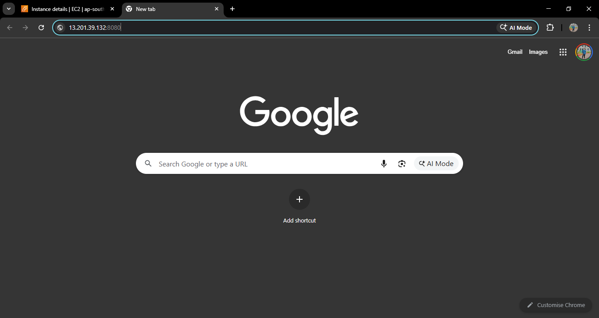
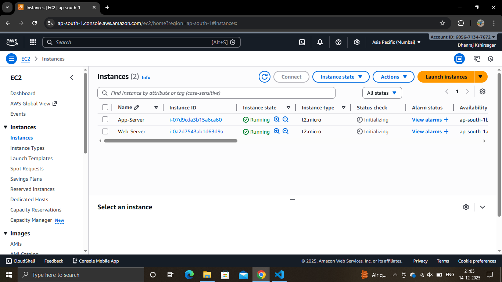

# 3-Tier E-Commerce Terraform Infrastructure 🏗️

A production-ready Infrastructure as Code (IaC) solution for deploying a scalable, secure, and highly available 3-tier e-commerce architecture on AWS using Terraform.

---

## 📋 Table of Contents

- [Project Overview](#project-overview)
- [Architecture Diagram](#architecture-diagram)
- [Features](#features)
- [Prerequisites](#prerequisites)
- [Project Structure](#project-structure)
- [Getting Started](#getting-started)
- [Configuration](#configuration)
- [Deployment](#deployment)
- [Outputs](#outputs)
- [Security Considerations](#security-considerations)
- [Cleanup](#cleanup)
- [Troubleshooting](#troubleshooting)

---

## 🎯 Project Overview

This project implements a **3-tier architecture** for e-commerce platforms with complete separation of concerns:

1. **Presentation Tier (Web Layer)** - Public-facing web servers
2. **Application Tier (App Layer)** - Business logic servers
3. **Data Tier (Database Layer)** - MySQL database

All tiers are deployed on AWS with proper network isolation, security groups, and load balancing.

### Architecture Diagram



---

## ✨ Features

✅ **Modular Design** - Each tier is a reusable Terraform module
✅ **High Availability** - Multi-AZ deployment with 2 public and 2 private subnets
✅ **Load Balancing** - Application Load Balancer (ALB) for distributing traffic
✅ **Security** - Security groups with principle of least privilege
✅ **Scalability** - Easy to scale EC2 instances and RDS capacity
✅ **Environment Variables** - Flexible configuration with Terraform variables
✅ **Secrets Management** - Sensitive data handled safely (DB credentials)
✅ **Infrastructure as Code** - Complete version control and repeatability

### EC2 Instance Details



---

## 🔧 Prerequisites

Before deploying, ensure you have:

1. **AWS Account** - Active AWS account with appropriate IAM permissions
2. **Terraform** - Version 1.0 or higher
   ```bash
   terraform version
   ```
3. **AWS CLI** - Configured with credentials
   ```bash
   aws configure
   ```
4. **Git** - For version control
5. **Basic Knowledge** - AWS, Terraform, and networking concepts

### Required IAM Permissions

Your AWS user/role needs permissions for:
- EC2 (instances, security groups)
- VPC (subnets, internet gateway, route tables)
- RDS (DB instances, subnet groups)
- Load Balancing (ALB, target groups)

---

## 📂 Project Structure

```
3tier_arcitecture/
├── main.tf                          # Root module instantiations
├── variable.tf                      # Root variables (AMI, DB credentials)
├── output.tf                        # Output values (ALB DNS)
├── terraform.tfvars.example         # Example variables file
├── .gitignore                       # Git ignore rules
├── README.md                        # This file
│
├── modules/
│   ├── vpc/
│   │   ├── main.tf                 # VPC, IGW, public/private subnets
│   │   ├── variable.tf             # VPC variables
│   │   └── outputs.tf              # VPC outputs (IDs, subnet IDs)
│   │
│   ├── alb/
│   │   ├── main.tf                 # Application Load Balancer setup
│   │   ├── variable.tf             # ALB variables
│   │   └── outputs.tf              # ALB DNS and security group ID
│   │
│   ├── web/
│   │   ├── main.tf                 # Web tier EC2 instances (public)
│   │   └── variable.tf             # Web tier variables
│   │
│   ├── app/
│   │   ├── main.tf                 # App tier EC2 instances (private)
│   │   └── variable.tf             # App tier variables
│   │
│   └── rds/
│       ├── main.tf                 # MySQL RDS instance
│       └── variables.tf            # RDS variables (credentials)
│
├── user-data/
│   ├── web.sh                       # Web server initialization script
│   └── app.sh                       # App server initialization script
│
└── Images/
    ├── Capture.PNG                  # Architecture diagram
    └── ec2.PNG                      # EC2 configuration diagram
```

---

## 🚀 Getting Started

### Step 1: Clone the Repository

```bash
git clone https://github.com/Dhanrajdk79/3Tier_Ecommerce_Terraform.git
cd 3tier_arcitecture
```

### Step 2: Initialize Terraform

```bash
terraform init
```

This downloads required AWS provider plugins and initializes the working directory.

### Step 3: Create Variables File

Copy the example file and add your secrets:

```bash
cp terraform.tfvars.example terraform.tfvars
```

Edit `terraform.tfvars` with your actual values:

```hcl
db_username = "admin"
db_password = "YourStrongSecurePassword123!"
```

⚠️ **IMPORTANT**: Never commit `terraform.tfvars` to version control. It's already in `.gitignore`.

---

## ⚙️ Configuration

### Root Variables (`variable.tf`)

| Variable | Description | Default | Type |
|----------|-------------|---------|------|
| `ami_id` | AMI ID for EC2 instances (Ubuntu 20.04 LTS) | `ami-03bb6d83c60fc5f7c` | string |
| `db_username` | RDS master username | `admin` | string |
| `db_password` | RDS master password | `changeme123!` | string (sensitive) |

### VPC Configuration (`modules/vpc/main.tf`)

- **VPC CIDR**: `10.0.0.0/16`
- **Public Subnets**: `10.0.0.0/24`, `10.0.1.0/24` (2 subnets, 2 AZs)
- **Private Subnets**: `10.0.10.0/24`, `10.0.11.0/24` (2 subnets, 2 AZs)
- **Region**: `ap-south-1` (Mumbai)

### Instance Types

- **Web/App Servers**: `t2.micro` (free tier eligible)
- **Database**: `db.t3.micro` (free tier eligible)
- **Database Engine**: MySQL 8.0

### Override Variables

Pass variables via command line:

```bash
terraform plan -var="db_password=NewPassword123"
```

Or via environment variables:

```bash
export TF_VAR_db_password="NewPassword123"
terraform plan
```

---

## 📦 Deployment

### Step 1: Validate Configuration

```bash
terraform validate
```

### Step 2: Review the Plan

```bash
terraform plan
```

Review the output to see what resources will be created.

### Step 3: Apply the Configuration

```bash
terraform apply
```

Type `yes` when prompted. Deployment typically takes 5-10 minutes.

### Step 4: Access Your Infrastructure

After deployment, retrieve the ALB DNS name:

```bash
terraform output alb_dns_name
```

Visit the URL in your browser to access the web tier through the load balancer.

---

## 📤 Outputs

After successful deployment, Terraform outputs:

```bash
Outputs:

alb_dns_name = "ecommerce-alb-xxxxx.ap-south-1.elb.amazonaws.com"
```

Use this DNS name to access your e-commerce platform.

---

## 🔒 Security Considerations

### Best Practices Implemented

✅ **Network Isolation**: Web tier (public) and App tier (private) are in separate subnets
✅ **Security Groups**: Minimal ingress/egress rules (least privilege)
✅ **Sensitive Data**: DB credentials are marked as sensitive and excluded from logs
✅ **Git Ignore**: State files and variable files are not committed
✅ **Example File**: `terraform.tfvars.example` provided as a template

### Additional Security Recommendations

1. **Rotate DB Credentials Regularly**
   ```bash
   terraform apply -var="db_password=NewPassword"
   ```

2. **Use AWS Secrets Manager** - Store credentials there instead of tfvars

3. **Enable VPC Flow Logs** - Monitor network traffic

4. **Enable RDS Backup** - Regular automated snapshots

5. **Use Terraform Remote State** - Store state in S3 with encryption
   ```hcl
   terraform {
     backend "s3" {
       bucket = "your-terraform-state"
       key    = "3tier/terraform.tfstate"
       region = "ap-south-1"
     }
   }
   ```

6. **Enable MFA Delete** - Protect S3 state bucket

7. **Regular Security Audits** - Review security group rules monthly

8. **Use SSL/TLS** - Add HTTPS certificates to ALB

---

## 🧹 Cleanup

To avoid AWS charges, destroy all resources:

```bash
terraform destroy
```

Type `yes` when prompted. This removes all created AWS resources.

⚠️ **WARNING**: This action is irreversible. Ensure you have backups if needed.

---

## 🐛 Troubleshooting

### Issue: `terraform validate` fails with missing variables

**Solution**: Ensure `terraform.tfvars` exists and has `db_username` and `db_password`.

```bash
cp terraform.tfvars.example terraform.tfvars
# Edit terraform.tfvars with your values
```

### Issue: AWS credentials not found

**Solution**: Configure AWS CLI credentials

```bash
aws configure
# Enter your Access Key, Secret Key, Region, and Output Format
```

Or use environment variables:

```bash
export AWS_ACCESS_KEY_ID="your_access_key"
export AWS_SECRET_ACCESS_KEY="your_secret_key"
export AWS_REGION="ap-south-1"
```

### Issue: EC2 instances fail to launch

**Solution**: Verify AMI ID is valid in your region

```bash
aws ec2 describe-images --region ap-south-1 \
  --filters "Name=name,Values=ubuntu/images/hvm-ssd/ubuntu-focal-20.04-amd64-server-*"
```

Update `variable.tf` with the correct AMI ID.

### Issue: Terraform state is locked

**Solution**: Release the lock (if safe to do)

```bash
terraform force-unlock <LOCK_ID>
```

### Issue: Connection timeout to RDS

**Solution**: Check RDS security group allows inbound from app tier

```bash
aws ec2 describe-security-groups --region ap-south-1 --query 'SecurityGroups[?Tags[?Key==`Name`&&Value==`app-sg`]]'
```

### Issue: High AWS costs

**Solution**: Use `t2.micro` instances (free tier) and delete unused resources

```bash
terraform destroy
```

---

## 📝 Log Files and Debugging

Enable debug logs:

```bash
export TF_LOG=DEBUG
terraform apply
unset TF_LOG
```

View logs in `terraform.log`:

```bash
less terraform.log
```

---

## 🔄 CI/CD Integration

### GitHub Actions Example

Create `.github/workflows/terraform.yml`:

```yaml
name: Terraform

on:
  push:
    branches: [main]
  pull_request:
    branches: [main]

jobs:
  terraform:
    runs-on: ubuntu-latest
    steps:
      - uses: actions/checkout@v3
      - uses: hashicorp/setup-terraform@v2
      - run: terraform init
      - run: terraform validate
      - run: terraform plan
```

---

## 📚 Additional Resources

- [Terraform Documentation](https://www.terraform.io/docs)
- [AWS Provider Documentation](https://registry.terraform.io/providers/hashicorp/aws/latest/docs)
- [AWS VPC Best Practices](https://docs.aws.amazon.com/vpc/latest/userguide/VPC_Subnets.html)
- [RDS Best Practices](https://docs.aws.amazon.com/AmazonRDS/latest/UserGuide/CHAP_BestPractices.html)

---

## 📄 License

This project is licensed under the MIT License. See LICENSE file for details.

---

## 👤 Author

**Dhanraj DK**

- GitHub: [@Dhanrajdk79](https://github.com/Dhanrajdk79)
- Repository: [3Tier_Ecommerce_Terraform](https://github.com/Dhanrajdk79/3Tier_Ecommerce_Terraform)

---

## 🤝 Contributing

Contributions are welcome! Please follow these steps:

1. Fork the repository
2. Create a feature branch (`git checkout -b feature/AmazingFeature`)
3. Commit changes (`git commit -m 'Add AmazingFeature'`)
4. Push to branch (`git push origin feature/AmazingFeature`)
5. Open a Pull Request

---

## ❓ FAQ

**Q: Can I use this in production?**
A: Yes, but review the security recommendations and customize for your needs.

**Q: How do I add more EC2 instances?**
A: Modify `count` in the web/app modules or create additional module instances.

**Q: Can I change the region?**
A: Yes, update the `region` in `main.tf` and adjust availability zones accordingly.

**Q: How do I backup my database?**
A: RDS has automatic backups. For manual backups, use AWS Console or AWS CLI.

**Q: What's the monthly cost?**
A: Using `t2.micro` (free tier), expect minimal costs. Check AWS pricing calculator for details.

---

## 🐛 Reporting Issues

Found a bug? Please create an issue on GitHub with:
- Terraform version
- AWS region
- Error message
- Steps to reproduce

---

**Happy Infrastructure Coding! 🚀**

Last Updated: December 2024
Version: 1.0.0
